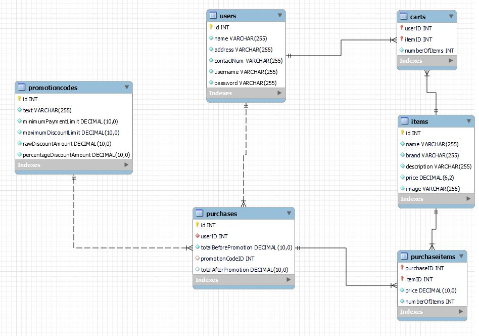

# toy-shop

## Brief:

The toyshop website is designed using mysql for the database, express for the
establishment of the API (REST API), and react for the frontend.
The hosting is done on Heroku for the backend whereas, Netlify for the frontend
Link to the website: https://ameedtoyshop.netlify.app/
Repository link: https://github.com/MohamedElsayed-22/toy-shop
Before running type: npm install

## Data base entity relational diagram (ERD):





In the following ERD diagram generated by MySQL Workbench, we illustrate the
tables with its relations and different attributes used in the project database.


## Backend endpoints:

Operation on `users`:
1 - /user/signup: post request used to insert new users to the backend database.
It does some checking on the data being introduced from the frontend which
basically are done to handle any violations regarding the database
constraints we introduced in the user database table.
Bcrypt is used to hash the password while adding salting to the password to
avoid having the hash code for the same passwords. This is considered an
add security layer. In this way if one user’s password is leaked in a way or
another and someone else by chance has the same password the intruder will
not recognize the other user’s password.
2 - /user/signin: post request username and password are taken from the
frontend. Aftering being verified, we give a token to the user to be able to
access the cart, payment orders and so on of his own only. Bcrypt is also
used to check for the password validity. While jsonwebtoken is used to
generate tokens.
Operations on `carts`:
1 - /cart: get request used to display all of the items in the cart. It takes the
token value into consideration to display the cart items of the user logging
in.
2 - /cart/add: post request used to add items to the cart. On each click one item
is being added.
3 - /cart/remove: post request to remove from the cart. One element at a time.
Operations on `items`:
1 - /item: get request used to fetch either all items which is used in this case
with the home page or in the search where this endpoint is customized to
take in the name, price range, brand name of the item and then search upon
these parameters or if theses values are null, all of the items in the table are
fetched.
Operations mainly on `purchase` in addition to `users`, `carts`,
`promotionCodes`, `purchasedItems`, and `items`:
1 - /purchase: post request to calculate the order cost. Apply the promocode if
any. While removing the items to be ordered from the cart.


2 - /purchase: get request displaying all items of the order which are specified
to a certain user.
Operations on the `promotionCodes`:
1 - /promotioncode: post request to take from the user the input and check if
this promocode is valid or not. The logic of the promocode is used in the
purchase endpoint. It simulates the real promocodes used including the
lower limit to apply the promocode the discount ratio and the maximum
discount.

## Frontend endpoints:

```
1 - /: home page which displays all of the available items in the database.
2 - /signin: a web page that shows the login form used to login to the user account.
3 - /signup: another web page that shows a signup form to register multiple users.
4 - /cart: web page showing all of the user items picked from the home page.
5 - /product: web page for each item illustrating all details about it.
6 - /orders: web page showing all of the previously done orders with their ids
and the order status. In addition to showing the total payment required for
such order.
```